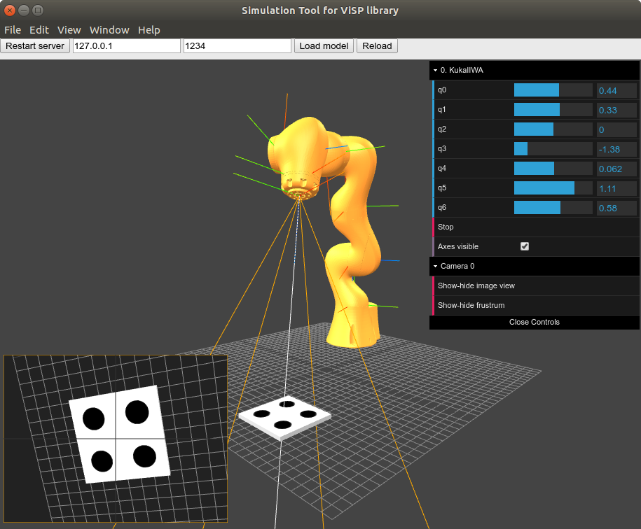

# VISA
**Vi**SP **S**imulation **A**pp is a generic simulator for medical robotics.

* [Description](#description)
	* [Screenshots](#screenshots)
* [Installation](#installation)
* [Support / Contribution](#support)

## Description 

The simulator works with 3D scenes that can contain different objects such as: static  **objects**, robots, and cameras. Static objects are simple 3D model files with the extensions:  _stl_,  _obj_  or  _dae_. These 3D models are static during simulation.

**Robots**  are the second type of scene elements. Currently, the simulator supports one continuum robot (concentric tube robot) with deformable parts. In addition, the app comes with two serial robots:  [KUKA iiwa](https://www.kuka.com/en-de/products/robot-systems/industrial-robots/lbr-iiwa)  and  [Viper650](http://www.ia.omron.com/products/family/3519/). It is worth noting, that any user can easily add a new serial robot: all you need to do is to provide forward kinematics model and files with 3D models of robot links.  _(Tutorial for this coming soon, stay tuned :))_

The platform offers two mechanisms for controlling robots during the simulation. First, you can execute commands through a small menu located at the top-right corner of the page. Or you can control your robot using a TCP-IP protocol as VISA app acts like a server.  _The link to the full list of supported commands will be here._

The last type of model object is  **cameras**. VISA enables placing a virtual camera anywhere in the scene. First of all, the camera may have a fixed position in space. Alternatively, it can be positioned in relation to another objection. For example, it can be placed on the robot’s end-effector. This way the camera will follow the robot’s movements. The image can be obtained using TCP-IP protocol. Currently, we are working on a pull request to add an adapter class between simulator and visual servoing library  [ViSP](https://visp.inria.fr/en/).

## Screenshots 

# Installation  

You can run VISA on Mac, Linux, and Windows. To do this, you'll need Git and Node.js (which comes with npm) installed on your computer. Just [follow this link](https://nodejs.org/en/) for more information. I would suggest to install an LTS version.

Then, from your command line:

    # clone this repository
    # go into the repository
    # install dependencies
    # run the app
    
    git clone https://github.com/avkudr/visa 
    cd visa
    npm install
    npm start

If you want to start the software in development mode ( displaying fps and console) use:

    npm run dev # instead of "npm start"

## Main dependencies

- [nodejs](https://nodejs.org/en/)
- [electron](https://electronjs.org/)
- [threejs](https://threejs.org/)

# Support / Contribution  

Please feel free to give us suggestions or report a bug by creating a  [new issue](https://github.com/avkudr/visa/issues)  via Github

